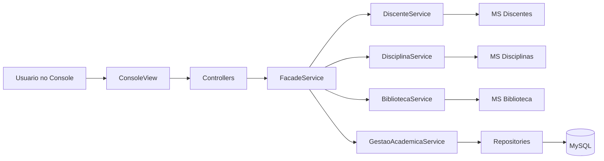

# 🎓 Sistema Acadêmico - UNIFOR

<div align="center">


**Sistema de Gestão Acadêmica com integração de microsserviços e persistência local**

</div>

---

## Conteúdo

- [Visão Geral](#visão-geral)
- [Stack e Ferramentas](#stack-e-ferramentas)
- [Arquitetura](#arquitetura)
- [Fluxo Principal](#fluxo-principal)
- [Funcionalidades Centrais](#funcionalidades-centrais)
- [Métricas do Projeto](#métricas-do-projeto)
- [Pré-requisitos](#pré-requisitos)
- [Configuração Local](#configuração-local)
- [Scripts e Comandos](#scripts-e-comandos)
- [Variáveis de Ambiente](#variáveis-de-ambiente)
- [Segurança e Confiabilidade](#segurança-e-confiabilidade)
- [Práticas de Engenharia](#práticas-de-engenharia)
- [Autor](#autor)

## Visão Geral

### Objetivos

- Simular, em Java, um cenário real de gestão acadêmica com regras de negócio explícitas.
- Integrar dados de discentes, disciplinas e biblioteca vindos de microsserviços externos.
- Persistir operações críticas (matrículas e reservas) em banco relacional local.

### Situação em que o sistema se aplica

- Contextos de laboratório/disciplina para exercitar arquitetura em camadas.
- Demonstrações de validações de negócio em fluxo transacional simples.
- Cenários com integração externa + cache local para reduzir latência percebida.

### Solução implementada

A aplicação foi construída como um sistema desktop em modo console, com separação em camadas (Controller, Service, Repository, Model, View), cache em memória para dados dos microsserviços e persistência MySQL para dados transacionais.

### Por que essa solução

- A arquitetura em camadas facilita manutenção e testes por responsabilidade.
- O cache reduz chamadas repetidas às APIs externas durante a sessão.
- O uso de JDBC/MySQL garante rastreabilidade das operações-chave sem complexidade de framework adicional.

## Stack e Ferramentas

### Core

- Java 21
- MySQL 8
- JDBC

### Bibliotecas e utilitários

- gson 2.10.1
- mysql-connector-j 8.0.33
- dotenv-java (carregamento de `.env`)

### Integrações externas (microsserviços)

- API de Discentes
- API de Disciplinas
- API de Biblioteca

### Padrões usados

- Factory Pattern (`ControllerFactory`)
- Facade Pattern (`FacadeService`)
- Repository Pattern
- Injeção de dependência por construtor

## Arquitetura

```text
src/
  Main.java
  controller/
  service/
  repository/
  model/
  exception/
  util/
  view/
  sql/

lib/
  mysql-connector-j-8.0.33.jar
  gson-2.10.1.jar
```

### Camadas

- View: interação de usuário via CLI (`ConsoleView`).
- Controller: orquestração de fluxo e entrada/saída.
- Service: regras de negócio e integração com dados externos.
- Repository: persistência de matrículas e reservas no MySQL.
- Model/Exception: domínio e regras de erro explícitas.

## Fluxo Principal



## Funcionalidades Centrais

- Consulta de discentes, disciplinas por curso e livros.
- Matrícula com validações de:
  - situação acadêmica ativa;
  - compatibilidade entre curso e disciplina;
  - limite máximo de matrículas por discente;
  - disponibilidade de vagas.
- Reserva de livros com verificação de disponibilidade no microsserviço e no banco local.
- Cancelamento e listagem de matrículas e reservas por discente.

## Métricas do Projeto

Snapshot técnico da base atual:

- 39 arquivos Java em `src`.
- 6 classes de controller (incluindo factory).
- 6 serviços de domínio/orquestração.
- 4 artefatos de repositório (interfaces + implementações).
- 7 modelos de domínio.
- 5 exceções customizadas.
- 3 microsserviços externos integrados.
- 2 tabelas transacionais principais (`matriculas` e `reservas_livros`).

## Pré-requisitos

- Java JDK 21+
- MySQL 8+

## Configuração Local

1. Clone o projeto:

```bash
git clone https://github.com/Shizuo0/AcademicSystem.git
cd AcademicSystem
```

2. Crie seu arquivo de ambiente:

```bash
cp .env.example .env
```

3. Configure o banco:

```bash
mysql -u root -p < src/sql/schema.sql
```

4. Compile:

```bash
javac -d bin -cp "lib/*" src/**/*.java src/*.java
```

No PowerShell, alternativa:

```powershell
javac -d bin -cp "lib/*" $(Get-ChildItem -Recurse -Filter *.java src/ | % FullName)
```

5. Execute:

```bash
# Windows
java -cp "bin;lib/*" Main

# Linux/Mac
java -cp "bin:lib/*" Main
```

## Scripts e Comandos

Como o projeto não usa build tool dedicada, os comandos principais são:

- `javac -d bin -cp "lib/*" src/**/*.java src/*.java` para compilação.
- `java -cp "bin;lib/*" Main` para execução no Windows.
- `java -cp "bin:lib/*" Main` para execução em Linux/Mac.

## Variáveis de Ambiente

Arquivo: `.env`

```env
DB_URL=jdbc:mysql://localhost:3306/sistema_academico
DB_USER=root
DB_PASSWORD=your_password_here
```

Fallback interno (caso `.env` não exista):

- URL padrão: `jdbc:mysql://localhost:3306/sistema_academico`
- Usuário padrão: `root`
- Senha padrão: `12345678`

## Segurança e Confiabilidade

- Uso de Prepared Statements nos repositórios (mitiga SQL Injection).
- Exceções de domínio para falhas previsíveis de negócio.
- Cache de integração com inicialização paralela (`CompletableFuture`) para reduzir tempo de carga.
- Logs de operação para apoiar diagnóstico.

## Práticas de Engenharia

- Separação por camadas e responsabilidades.
- Regras de negócio centralizadas em services.
- Persistência isolada via interfaces de repositório.
- Modelagem de exceções específicas ao domínio acadêmico.

## Autor

**Paulo Shizuo Vasconcelos Tatibana**

- GitHub: https://github.com/Shizu0n
- LinkedIn: https://www.linkedin.com/in/paulo-shizuo/
